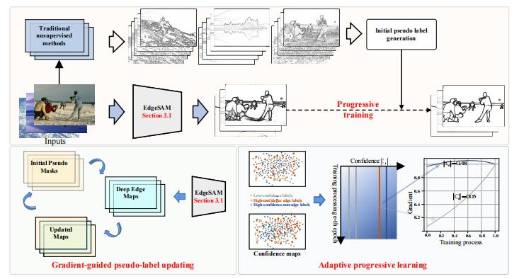
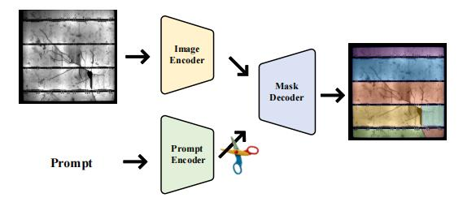
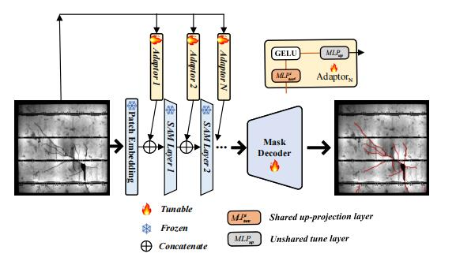
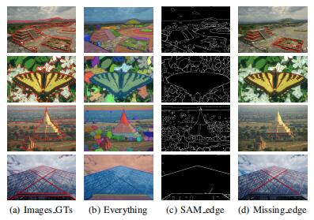
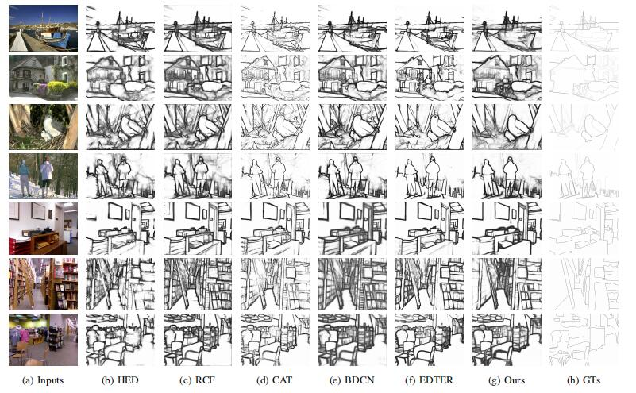

# Boosting Deep Unsupervised Edge Detection via Segment Anything Model
by Wenya Yang, Wen Wu, Hongshuai Qin, Kangming Yan, Xiaoyang Mao, Haichuan Song, and Xiao-Diao Chen

#### News: In 2023.7.15, We release the unsorted code for other researchers. The sorted code will be released after.

***

## SAM and EdgeSAM
### SAM's architecture

### ShadowSAM's architecture

### The edge obtained by SAM everything mode

## Visual comparison with SOTA

## Requirement
* Python 3.6
* PyTorch 1.10
* torchvision
* timm 0.3.2
* numpy
* tqdm
* PIL
* pydensecrf ([here](https://github.com/Andrew-Qibin/dss_crf) to install)

